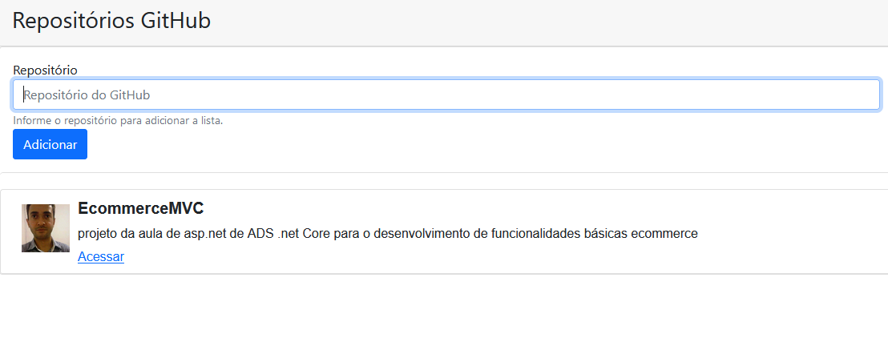

**API que pega os dados do repositório do github e mostra na tela**

**USO:**
no input insere o repositorio/usuario

Exemplo:
**ronaldogdn/EcommerceMVC**

**Para apagar é só clicar no repositório criado**

